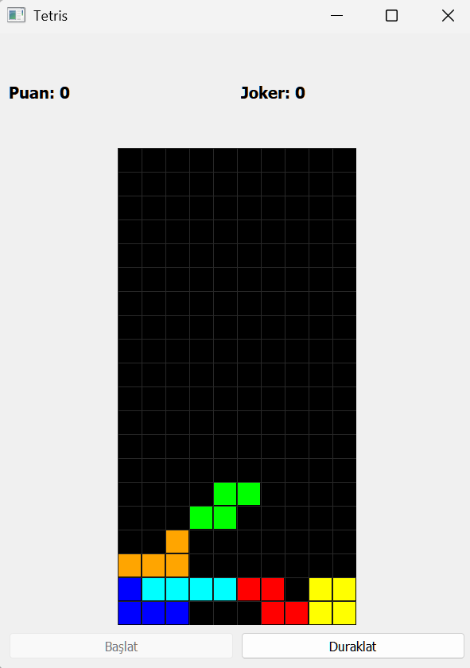

# Timer Application

A comprehensive timer and reminder application built with Python and Tkinter, featuring games and a rich notification system.

## Features

### ⏰ Timer & Reminder System
- **Timer Mode**: Countdown from a specified duration (great for Pomodoro technique, exercise breaks, cooking)
- **Reminder Mode**: Set alarms for specific dates and times
  - One-time reminders for meetings and appointments
  - Recurring reminders for daily, weekly, or monthly routines
- **Visual Progress**: Real-time countdown display with progress bar
- **Full Control**: Start, pause, and reset functionality
- **Audio Alerts**: Multiple alarm sound options
- **Theme Support**: Light and dark mode interfaces

### 🎮 Integrated Games
- **Sudoku**: Classic number puzzle game with difficulty levels
- **Tetris**: Block-falling puzzle game with scoring system

### 📁 File Analysis Tools
- File and directory analysis utilities
- Text formatting and processing tools
- Logging and debugging features

## Screenshots




## Installation

1. Clone this repository:
```bash
git clone [repository-url]
cd timer
```

2. Install required dependencies:
```bash
pip install tkinter pygame
```

3. Run the application:
```bash
python timer-01.py
```

## Usage

### Timer Mode
1. Select "Zamanlayıcı" (Timer) mode
2. Set your desired duration in minutes
3. Click "Başlat" (Start) to begin countdown
4. Use "Duraklat" (Pause) and "Sıfırla" (Reset) as needed

### Reminder Mode
1. Select "Hatırlatıcı" (Reminder) mode
2. Set your desired date and time
3. Choose one-time or recurring options
4. Add a custom message if needed

### Games
- Access Sudoku and Tetris games from the main menu
- Scores are automatically saved and tracked
- Multiple difficulty levels available

## File Structure

- `timer-01.py` - Main application file
- `dialog_classes.py` - Dialog and UI components
- `timer_*.py` - Timer system modules
- `sudoku_game.py` - Sudoku game implementation
- `tetris_game.py` - Tetris game implementation
- `timer-data/` - Audio files for alarms
- `screenshots/` - Application screenshots

## Audio Files

The application includes a variety of alarm sounds:
- Piano melodies
- Soft notification tones
- Countdown signals
- Beep tones

## Requirements

- Python 3.7+
- tkinter (usually comes with Python)
- pygame (for audio playback)

## License

This project is open source and available under the MIT License.

## Contributing

Feel free to contribute to this project by submitting issues or pull requests.
